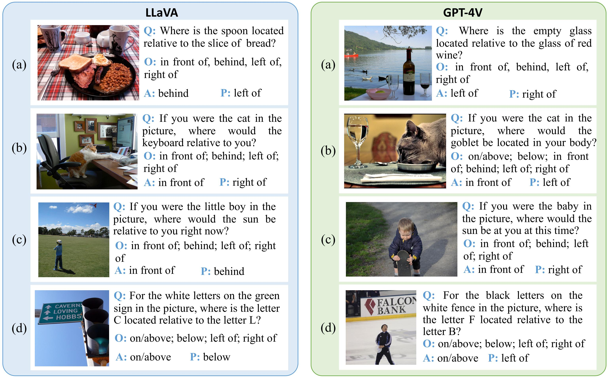

 

  <h1 align="center">Can Multimodal Large Language Models Understand Spatial Relations</h1>
  <h3 align="center">SpatialMQA: A new dataset for spatial reasoning of MLLMs.</h3>
  
  
  
<!--     <a href="https://arxiv.org/abs/2205.00363">arxiv</a> -->
    ·
    <a href="https://github.com/ziyan-xiaoyu/SpatialMQA/master/Dataset">dataset</a>
    ·
<!--     <a href="https://paperswithcode.com/sota/visual-reasoning-on-vsr">benchmark</a> -->
    
  

### 1 Overview

Spatial relation reasoning is a crucial task for multimodal large language models(MLLMs) to understand the objective world. Despite significant attention, existing datasets for spatial relation reasoning have several shortcomings: 
    · Reliance on bounding box labeling
    · Lack of real-world modeling standards
    · Questions that can be answered solely by model prior knowledge
All above hinder research in this area for MLLMs. In this paper, we propose SpatialMQA, a high-quality, human-annotated spatial relation reasoning dataset collected from COCO2017, which enables MLLMs to focus more on understanding images in real-world situations. To ensure the quality of the dataset, we design a well-tailored annotation procedure. Based on SpatialMQA, a series of closed- and open-source MLLMs are implemented and the results indicate that the current state-of-the-art MLLM achieves an accuracy of only 47% on SpatialMQA, which is significantly lower than human-level accuracy of 97.86%. Extensive experimental analyses are also conducted, suggesting the future research directions for this task.

### 2 SpatialMQA dataset
SpatialMQA is a manually annotated dataset designed for multimodal spatial relation reasoning in a multiple-choice question & answer format. The dataset includes 5,392 samples collected from COCO2017, covering 128 subject and object types, without bounding boxes. To address the limitations of existing datasets, we clearly define annotation guidelines for SpatialMQA, including standardizing the objective world as the coordinate system and avoiding questions that can be answered solely by the question itself. 

#### 2.1 Examples
The following table lists some classic examples in our dataset.

  |   |    |  
:-------------------------:|:-------------------------:|:-------------------------:|:-------------------------:
Q: Where is the fork located relative to the pizza? O: on/above, below, in front of, behind, left of, right of A: right of  |  Q: Where is the cat located relative to the car in the picture? O: on/above, below, in front of, behind, left of, right of A: on/above | Q: For the white letters on the red warning sign, where is the letter P located relative to the letter Y? O: on/above, below, left of, right of A: on/above | Q: If you are the cyclist in the picture, where is the dog located relative to you? O: in front of, behind, left of, right of_ A: behind

  |   |    |  
:-------------------------:|:-------------------------:|:-------------------------:|:-------------------------:
_{"image": "000000121362.jpg", "question": "If you are the player in the picture, where is the audience located relative to you?", "options": ["in front of", "behind", "left of", "right of"], "answer": "behind"}   |  _{"image": "000000142379.jpg", "question": "If you are the giraffe in the picture, where is the tree located relative to you?", "options": ["in front of", "behind", "left of", "right of"], "answer": "behind"} | _{"image": "000000015740.jpg", "question": "If you are the woman in the picture, from your perspective, where is the mouse located relative to the keyboard?", "options": ["on/above", "below", "in front of", "behind", "left of", "right of"], "answer": "left of"} | _{"image": "000000005255.jpg", "question": "If you are the pilot of the plane in the middle of the picture, from your perspective, where are the two boys sitting on the ground located relative to you?", "options": ["in front of", "behind", "left of", "right of"], "answer": "behind"}

#### 2.2 Splits
The following table lists the detailed information statistics of the splited dataset.
1/放数据集划分后的数据概览

Check out [`data/`](https://github.com/ziyan-xiaoyu/SpatialMQA/Dataset) for more details.

#### 2.3 Compare with other datasets
We first objectively investigated the existing multimodal datasets that include spatial relationship recognition tasks. The results are shown in the figure below. Then, we proposed SpatialMQA to address the shortcomings of the existing baselines, which includes the following features:
《列举贡献点123》
**_More data != better performance._** The relations are sorte

1/数据集调研表

2/数据集对比图

### 3 Experiment results
#### 3.1 The experiment results of the MLLMs we choose

1/实验结果的图

#### 3.2 Error case for GPT-4V and Gemini

1/案例对比的图

### Citation

### License
This project is licensed under the [Apache-2.0 License](https://github.com/ziyan-xiaoyu/SpatialMQA/master/LICENSE).
