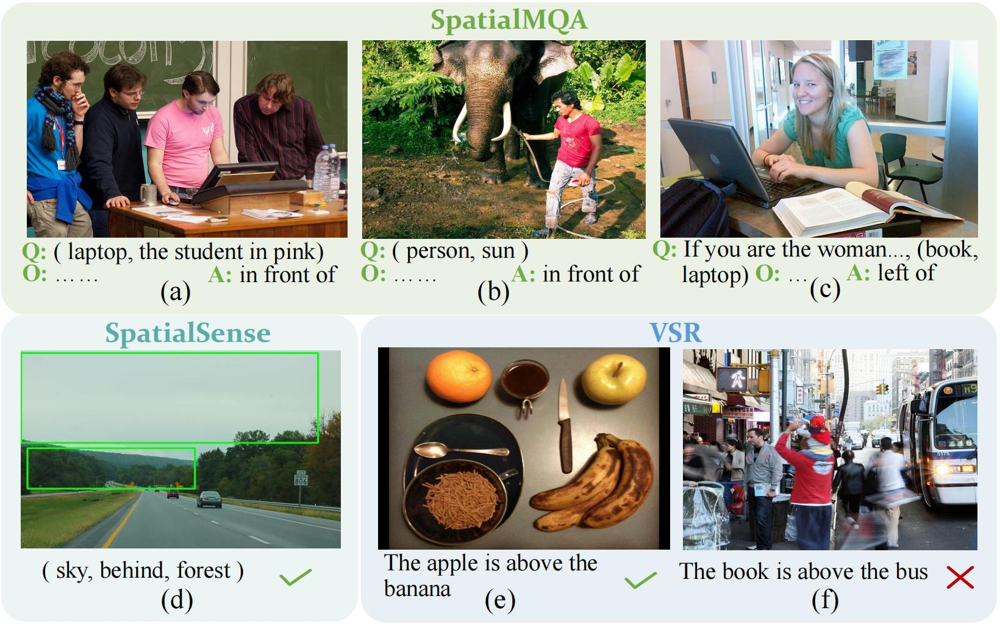

 

  <h1 align="center">Can Multimodal Large Language Models Understand Spatial Relations</h1>
  <h3 align="center">SpatialMQA: A new dataset for spatial reasoning of MLLMs.</h3>
  
  
  
<!--     <a href="https://arxiv.org/abs/2205.00363">arxiv</a> -->
    ·
    <a href="https://github.com/ziyan-xiaoyu/SpatialMQA/master/Dataset">dataset</a>
    ·
<!--     <a href="https://paperswithcode.com/sota/visual-reasoning-on-vsr">benchmark</a> -->
    
  

### 1 Overview

Spatial relation reasoning is a crucial task for multimodal large language models(MLLMs) to understand the objective world. Despite significant attention, existing datasets for spatial relation reasoning have several shortcomings: reliance on bounding box labeling, lack of real-world modeling standards, and questions that can be answered solely by model prior knowledge, all of which hinder research in this area for MLLMs. In this paper, we propose SpatialMQA, a high-quality, human-annotated spatial relation reasoning dataset collected from COCO2017, which enables MLLMs to focus more on understanding images in real-world situations. To ensure the quality of the dataset, we design a well-tailored annotation procedure. Based on SpatialMQA, a series of closed- and open-source MLLMs are implemented and the results indicate that the current state-of-the-art MLLM achieves an accuracy of only 47% on SpatialMQA, which is significantly lower than human-level accuracy of 97.86%. Extensive experimental analyses are also conducted, suggesting the future research directions for this task.

### 2 SpatialMQA dataset
SpatialMQA is based on manual annotation of images in the COCO dataset. Without relying on bbox, it divides the spatial relationship categories into six categories according to the concept of spatial coordinate system. The divisions are regular and have no intersections. 
At the same time, we ensure the richness of subject and object categories, eliminate language bias, and examine the ability of MLLMs to substitute different perspectives, while maintaining a relatively balanced amount of data. 
In addition, based on the centralized training of the team, we use script tools for manual annotation, which greatly improves the quality of the dataset and the consistency of standards.

#### 2.1 Examples
The following table lists some classic examples in our dataset.

  |   |    |  
:-------------------------:|:-------------------------:|:-------------------------:|:-------------------------:
_The cat is behind the laptop_.  (True)   |  _The cow is ahead of the person._ (False) | _The cake is at the edge of the dining table._ (True) | _The horse is left of the person._ (False)

_The cat is behind the laptop_.  (True)   |  _The cow is ahead of the person._ (False) | _The cake is at the edge of the dining table._ (True) | _The horse is left of the person._ (False)
:-------------------------:|:-------------------------:|:-------------------------:|:-------------------------:
  |   |    |  

#### 2.2 Splits
The following table lists the detailed information statistics of the splited dataset.
1/放数据集划分后的数据概览

Check out [`data/`](https://github.com/ziyan-xiaoyu/SpatialMQA/Dataset) for more details.

#### 2.3 Compare with other datasets
We first objectively investigated the existing multimodal datasets that include spatial relationship recognition tasks. The results are shown in the figure below. Then, we proposed SpatialMQA to address the shortcomings of the existing baselines, which includes the following features:
《列举贡献点123》
**_More data != better performance._** The relations are sorte

1/数据集调研表

2/数据集对比图

### 3 Experiment results
#### 3.1 The experiment results of the MLLMs we choose

1/实验结果的图

#### 3.2 Error case for GPT-4V and Gemini

1/案例对比的图

### Citation

### License
This project is licensed under the [Apache-2.0 License](https://github.com/ziyan-xiaoyu/SpatialMQA/master/LICENSE).
