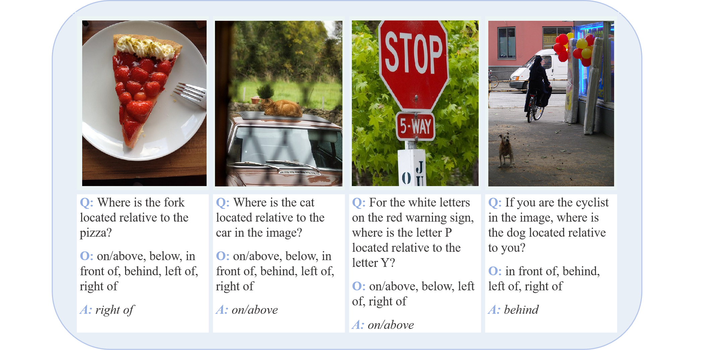
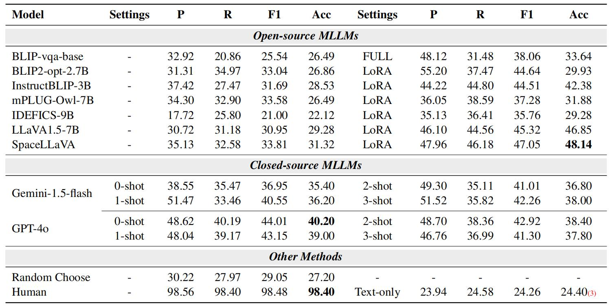
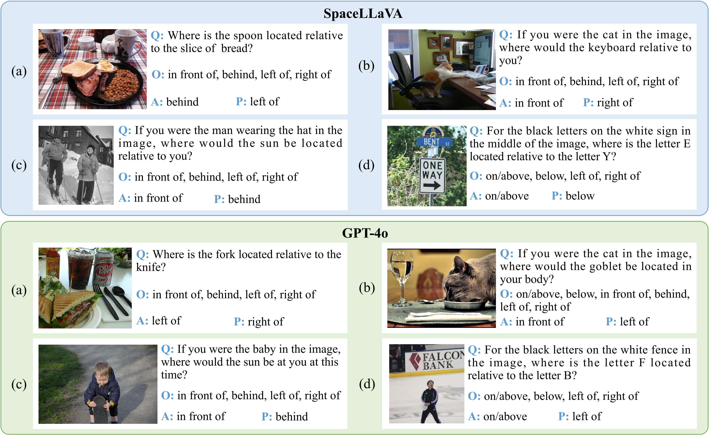

 

  <h1 align="center">Can Multimodal Large Language Models Understand Spatial Relations</h1>
  <h3 align="center">SpatialMQA: A new dataset for spatial reasoning of MLLMs.</h3>
  
  
  
<!--     <a href="https://arxiv.org/abs/2205.00363">arxiv</a> -->
    ·
    <a href="https://github.com/ziyan-xiaoyu/SpatialMQA/blob/master/Dataset">dataset</a>
    ·
<!--     <a href="https://paperswithcode.com/sota/visual-reasoning-on-vsr">benchmark</a> -->
    
  

### 1 Overview

Spatial relation reasoning is a crucial task for multimodal large language models(MLLMs) to understand the objective world. Despite significant attention, existing datasets for spatial relation reasoning have several shortcomings: 
 • Reliance on bounding box labeling
 • Lack of real-world modeling standards
 • Questions that can be answered solely by model prior knowledge
All above hinder research in this area for MLLMs. In this paper, we propose SpatialMQA, a high-quality, human-annotated spatial relation reasoning dataset collected from COCO2017, which enables MLLMs to focus more on understanding images in real-world situations. To ensure the quality of the dataset, we design a well-tailored annotation procedure. Based on SpatialMQA, a series of closed- and open-source MLLMs are implemented and the results indicate that the current state-of-the-art MLLM achieves an accuracy of only 47% on SpatialMQA, which is significantly lower than human-level accuracy of 97.86%. Extensive experimental analyses are also conducted, suggesting the future research directions for this task.

### 2 SpatialMQA dataset
SpatialMQA is a manually annotated dataset designed for multimodal spatial relation reasoning in a multiple-choice question & answer format. The dataset includes 5,392 samples collected from COCO2017, covering 128 subject and object types, without bounding boxes. To address the limitations of existing datasets, we clearly define annotation guidelines for SpatialMQA, including standardizing the objective world as the coordinate system and avoiding questions that can be answered solely by the question itself. 

#### 2.1 Examples
The following figures list some classic examples in our dataset. 

#### 2.2 Splits
The following table lists the detailed information statistics of the splited dataset. 

Check out [`data/`](https://github.com/ziyan-xiaoyu/SpatialMQA/blob/Dataset) for more details.

#### 2.3 Compare with other datasets
We first objectively investigated the existing multimodal datasets that include spatial relationship recognition tasks. The results are shown in the figure below. Then, we proposed SpatialMQA to make up for the shortcomings of the existing datasets, which includes the following features:
 • We propose a new manually annotated high-quality dataset for multimodal spatial relation reasoning (SpatialMQA). This dataset includes questions that cannot be answered using only prior knowledge from MLLMs without the aid of images, and without bounding box.
 • SpatialMQA’s primary feature is its use of the objective world as a reference system for annotation, involving questions that encompass both the first perspective and the third perspective. 
 

 

### 3 Experiment results
We conduct extensive experiments on SpatialMQA and report the performance of both open- and closed-source MLLMs. The accuracy of the state-of-the-art (SoTA) methods, including GPT-4v and the fine-tuned LLaVA, on our dataset is only 39.80% and 46.85%, respectively, which is significantly below the human accuracy level of 97.86%. We further provide detailed analyses and point out promising directions for future research
#### 3.1 The experiment results of the MLLMs we choose

 

#### 3.2 Error case for GPT-4V and Gemini

### Citation

### License
This project is licensed under the [Apache-2.0 License](https://github.com/ziyan-xiaoyu/SpatialMQA/blob/master/LICENSE).
